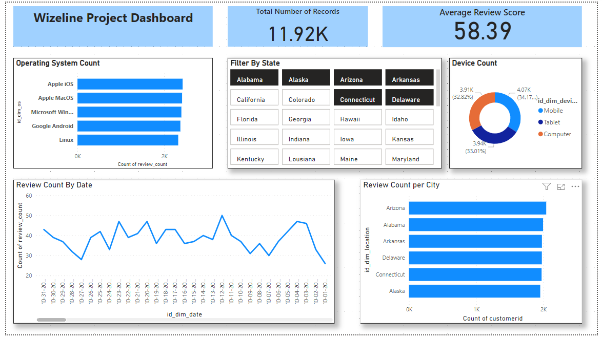
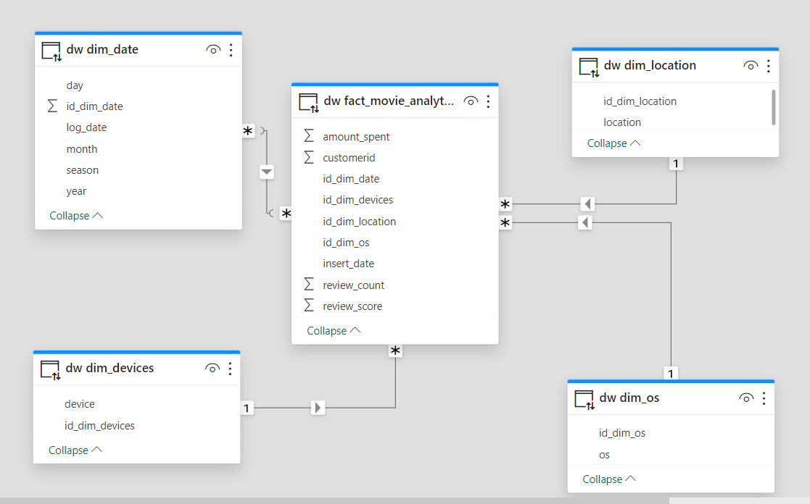
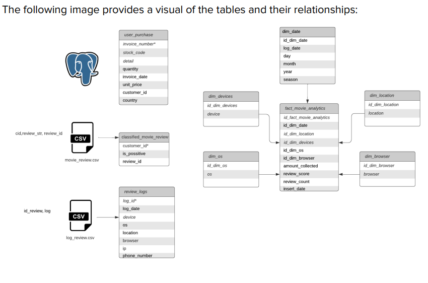
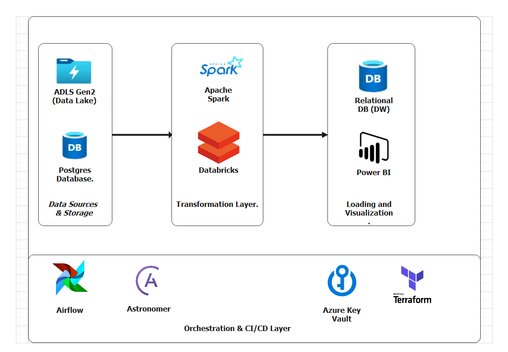
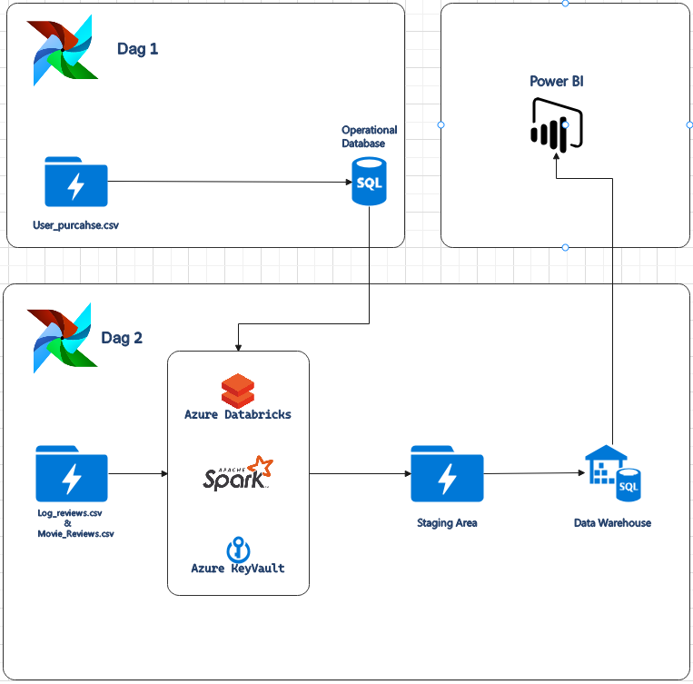
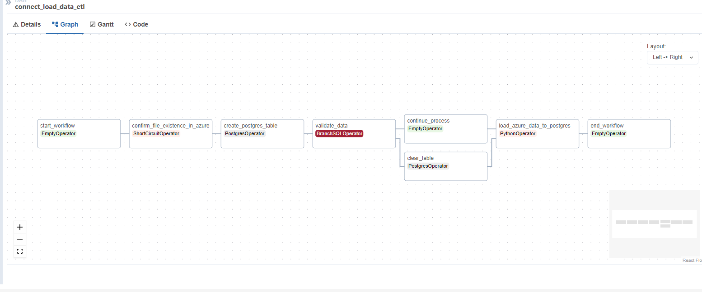
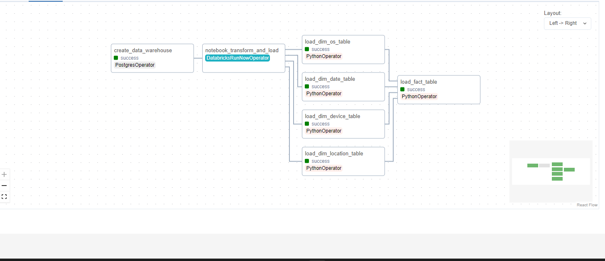

# Wizeline Data Engineering Capstone Project

## Bi DashBoard (End Result)

## Bi Schema

## Context 

### Expected Outcome
The goal is to create an end-to-end solution; this problem reflects a real-world scenario
where a Data Engineer must configure the environment and resources, integrate the data
from external sources, clean it, and process it for further analysis. When the data is ready,
transform it to reflect business rules and deliver knowledge in the form of insights

### Problem Description.
I was tasked with building a data pipeline to populate the
fact_movie_analytics table, an OLAP table. The data from fact_movie_analytics
is helpful for analysts and tools like dashboard software
- A PostgreSQL table named user_purchase
- Daily data by an external vendor in a CSV file named movie_review.csv that
populates the classified_movie_review table. This file contains a customer id,
a review id, and the message from the movie review.
- Daily data by an external vendor in a CSV file named log_reviews.csv. This file
contained the id review and the metadata about the session when the movie
review was done, like log date, device (mobile, computer), OS (windows, Linux),
region, browser, IP, and phone number

## Infrastructure & Tools Used
List Of tools used to build the pipeline .

- Apache Airflow 
- PySpark
- Azure Cloud Platform
- Terraform
- Azure Key Vault
- Azure Databricks
- Azure Data Lake
- Azure SQL (Data Warehouse)
- Astronomer
- Power BI

## Approach and Pipeline Workflow.

- 2 Dags are created in ariflow. Dag 
    -   Dag 1 Loads the csv data that is supposed to serve as the operational data from the application
    - Dag 2 Collects data from all the different sources and calls the notebook that performs the transformation from a databricks notebook using apache spark in the background. Due to the volume of the data being processed. 
    - All the data is then stored in the staging area before it is loaded into the warehouse by dag 2.

### Pipeline 

### Dag 1

### Dag 2

## Lessons Learnt
- Incorporating Azure Data Engineering Solutions with APache Airflow
- Deploying Infrastructure with Terraform
- Calling Databricks Notebook runs with Apache Airflow.
- Working with Azure Key Vault from Databricks
- Working with Power BI for Visualizing Data.
